# 📊 Genesys CSV Interaction Query Tool

A powerful, browser-based tool for exploring and analyzing Genesys Cloud interaction exports. Query your call center data using simple SQL-like commands — no technical expertise required!


---

## ✨ Features

| Feature | Description |
|---------|-------------|
| 📁 **Multi-File Upload** | Upload and merge multiple CSV exports at once |
| 🔍 **SQL Queries** | Search your data using simple SQL-like syntax |
| 🏷️ **Attribute Search** | Query participant attributes (CustomerID, account info, custom data, etc.) |
| 📋 **Schema Explorer** | Browse all available columns and attributes |
| 💾 **Export Results** | Download query results as CSV |
| 🎨 **Modern Interface** | Clean, intuitive design using Genesys Spark styling |

---

## � How It Works


---

## 🧩 Query Structure

Understanding how queries work:

```mermaid
flowchart TB
    subgraph Query["📝 SQL Query Structure"]
        direction TB
        SELECT["<b>SELECT</b><br/>Choose columns to display"]
        FROM["<b>FROM interactions</b><br/>Always use 'interactions'"]
        WHERE["<b>WHERE</b><br/>Filter conditions"]
        LIMIT["<b>LIMIT</b><br/>Max rows to return"]
        
        SELECT --> FROM --> WHERE --> LIMIT
    end
    
    subgraph Columns["📊 Column Types"]
        direction TB
        STD["<b>Standard Columns</b><br/>[Conversation ID]<br/>[Users]<br/>[Date]<br/>[Queue]"]
        ATTR["<b>Participant Attributes</b><br/>ATTR('CustomerID')<br/>ATTR('AccountType')<br/>ATTR('Priority')"]
    end
    
    SELECT -.-> STD
    SELECT -.-> ATTR
    
    style Query fill:#f8f9fa,stroke:#6c757d
    style Columns fill:#e7f1ff,stroke:#0d6efd
```



---

## �🚀 Getting Started

### Step 1: Open the Tool
Simply open `index.html` in your web browser (Chrome, Edge, or Firefox recommended).

### Step 2: Upload Your Data
1. Click **"Select CSV Files"** or drag and drop your Genesys export files
2. You can upload multiple files — they will be merged automatically if columns match
3. Click **"Process & Merge Files"** to load your data

### Step 3: Query Your Data
Use the SQL editor to search and filter your interactions. Don't worry — it's simpler than it sounds!

---

## 📝 Query Examples

### Basic Queries

**View all records:**
```sql
SELECT * FROM interactions LIMIT 200
```

**Find disconnected calls:**
```sql
SELECT [Conversation ID], [Users], [Date], [Queue], [Wrap-up] 
FROM interactions 
WHERE [Wrap-up] = 'Disconnect' 
LIMIT 200
```

**Filter by direction:**
```sql
SELECT * FROM interactions 
WHERE [Direction] = 'inbound' 
LIMIT 200
```

### Searching Participant Attributes

Use the special `ATTR('attribute_name')` function to search participant data:

**Find calls with Customer ID:**
```sql
SELECT [Conversation ID], [Users], ATTR('CustomerID'), ATTR('AccountType') 
FROM interactions 
WHERE ATTR('CustomerID') != '' 
LIMIT 200
```

**Filter by account type:**
```sql
SELECT * FROM interactions 
WHERE ATTR('AccountType') = 'Premium' 
LIMIT 200
```

**Find VIP customers:**
```sql
SELECT [Conversation ID], ATTR('CustomerID'), ATTR('Priority'), ATTR('Region') 
FROM interactions 
WHERE ATTR('Priority') = 'High' 
LIMIT 200
```

**Technical Support calls:**
```sql
SELECT [Conversation ID], [Users], ATTR('IssueType'), ATTR('ProductLine') 
FROM interactions 
WHERE ATTR('IssueType') = 'Technical' 
LIMIT 200
```

---

## 🎯 Quick Reference

### Common Operators

| Operator | Example | Description |
|----------|---------|-------------|
| `=` | `WHERE [Queue] = 'Sales'` | Exact match |
| `!=` | `WHERE ATTR('CustomerID') != ''` | Not equal |
| `LIKE` | `WHERE [Users] LIKE '%John%'` | Contains text |
| `AND` | `WHERE [Direction] = 'inbound' AND [Queue] = 'Support'` | Multiple conditions |
| `OR` | `WHERE ATTR('Region') = 'East' OR ATTR('Region') = 'West'` | Either condition |

### Tips for Success

- ✅ **Use brackets** for column names with spaces: `[Conversation ID]`
- ✅ **Use ATTR()** for participant attributes: `ATTR('CustomerID')`
- ✅ **Add LIMIT** to prevent slow queries on large datasets
- ✅ **Click column names** in the Schema Explorer to auto-insert them
- ✅ **Use Quick Filters** buttons for common queries

---

## 📁 Exporting Data

After running a query:
1. Click the **"Export CSV"** button in the results section
2. Your filtered data will download as a CSV file
3. Open in Excel or Google Sheets for further analysis

---

## ❓ Troubleshooting

| Issue | Solution |
|-------|----------|
| **File won't upload** | Ensure the file is a `.csv` format exported from Genesys Cloud |
| **Columns don't merge** | All files must have identical column headers to merge |
| **Query returns no results** | Check spelling and try a simpler query first |
| **Page is slow** | Add `LIMIT 100` to reduce the number of results |

---

## 🔒 Privacy & Security

- ✅ **100% Client-Side**: All data processing happens in your browser
- ✅ **No Upload**: Your data is never sent to any server
- ✅ **No Storage**: Data is cleared when you close the browser tab

---

